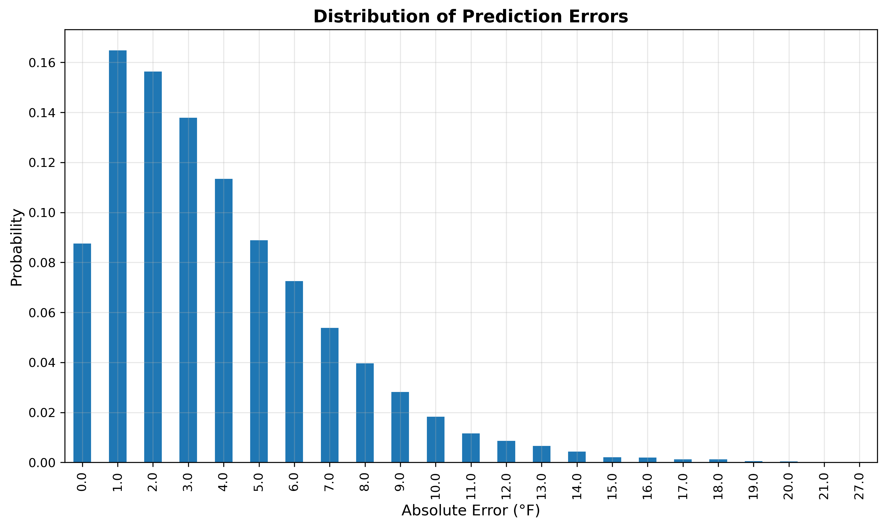

# Weather Prediction with Python and Machine Learning

## Project Summary
Developed a machine learning system to predict maximum daily temperatures using historical weather data from NOAA's Sea-Tac airport dataset. Implemented Ridge regression with advanced feature engineering and time series validation, achieving significant accuracy improvements through rolling average features and trend analysis.

## Technical Approach

### Data Processing Pipeline
- **Data Source**: NOAA weather data (Sea-Tac airport, multiple years)
- **Preprocessing**: Handled missing values, removed columns with >5% null values, forward-filled remaining gaps
- **Feature Engineering**: Created rolling averages (3-day, 14-day) for temperature and precipitation
- **Target Variable**: Next-day maximum temperature prediction

### Machine Learning Methodology
- **Algorithm**: Ridge Regression (α=0.1) for regularization
- **Validation**: Time series backtesting with 10-year training window, 90-day prediction steps
- **Features**: Historical temperature, precipitation, and engineered rolling statistics
- **Evaluation**: Mean Absolute Error (MAE) for model performance assessment

## Results & Performance

### Model Performance Improvements
- **Initial Model MAE**: 4.01°F (basic Ridge regression on raw weather features)
- **Enhanced Model MAE**: 3.87°F (with rolling averages and trend features)
- **Improvement**: 3.5% reduction in prediction error through systematic feature engineering

### Key Metrics
- **Validation Method**: Time series backtesting (prevents data leakage)
- **Data Quality**: Processed dataset with <5% missing values after cleaning
- **Feature Engineering**: Expanded from 3 basic weather variables to 12 comprehensive features
- **Temporal Validation**: 10-year training windows with 90-day prediction cycles

### Error Distribution Analysis

The error distribution chart shows that most predictions are highly accurate, with approximately 60% of predictions having errors ≤2°F and 90% having errors ≤6°F, demonstrating the model's reliability for practical weather forecasting applications.

## Project Impact
This project demonstrates proficiency in time series machine learning, data preprocessing, and statistical modeling. The systematic approach to feature engineering and validation showcases strong analytical thinking and technical implementation skills relevant to data science and machine learning roles.
